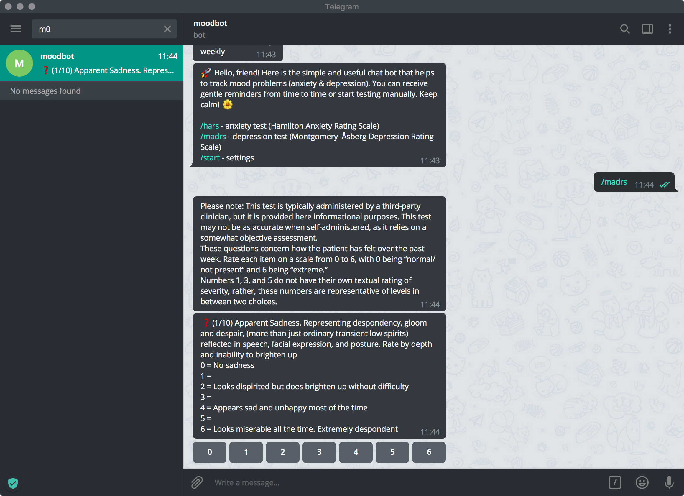
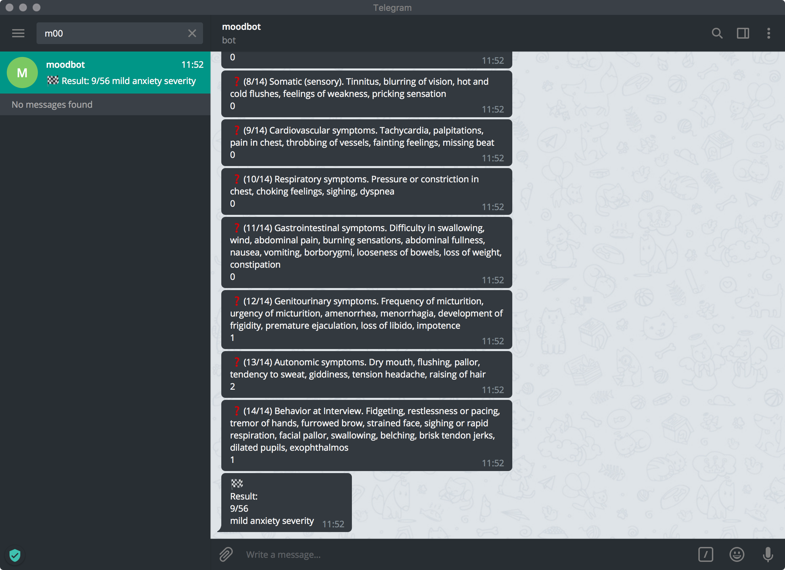

# Depression and anxiety self-testing telegram bot

[](https://travis-ci.org/dizballanze/m00dbot)
[](https://saythanks.io/to/dizballanze)

Telegram [bot](https://t.me/m00dbot) for self-testing of depression and anxiety.

Supported tests:

- [Hamilton Anxiety Rating Scale](https://en.wikipedia.org/wiki/Hamilton_Anxiety_Rating_Scale)
- [Montgomery–Åsberg Depression Rating Scale](https://en.wikipedia.org/wiki/Montgomery%E2%80%93%C3%85sberg_Depression_Rating_Scale)

## Usage

```
git clone git@github.com:dizballanze/m00dbot.git
cd m00dbot
python3 -m venv venv
source venv/bin/activate
pip install -r requirements.txt
# Create database
python create_db.py <database file name>
# Start bot
TG_TOKEN="<telegram bot token>" DB_NAME="<database file name>" python bot.py
```

## Screenshots





## License

MIT License
